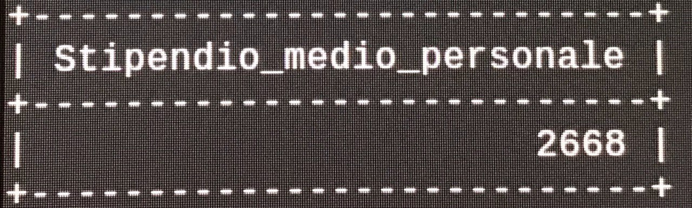

# Clinica Magi  
## Abstract  

 
Siamo nel 1958, il Prof. Vitangelo Moscarda, chirurgo ortopedico, e la moglie Ada fondano Clinica Magi. Il loro obiettivo è creare una nuova istituzione per soddisfare le crescenti necessità assistenziali dei cittadini vicentini, in campo ortopedico , traumatologico e non solo. Nel 1959 la clinica viene autorizzata per la gestione di 30 posti letto nella nuovissima sede in provincia di Vicenza, a Costabissara, un paesetto fondamentalmente di contadini, ma è qui che si decide di cominciare, dalle persone bisognose. All'inizio degli anni sessanta, la clinica comincia a disporre di 69 posti letto, e con l'arrivo del nuovo decennio viene aperta una seconda sede a Padova. Sotto la guida del Dr. Panzimonio (metà anni novanta, figlio di Vitangelo e Ada, che hanno da poco cessato di lavorare), la direzione sceglie di dare alla struttura un deciso indirizzo chirurgico con le specializzazioni di Ortopedia e Traumatologia, Chirurgia Generale, Chirurgia Plastica, Estetica e Oculistica, aprendo così una nuova sede a Verona. L’organico di medici e paramedici viene progressivamente ampliato e vengono avviate collaborazioni con specialisti d’eccellenza in diversi campi, che contribuiscono a consolidare l’identità della Clinica come centro di chirurgia all’avanguardia. Il percorso intrapreso porta, dunque, ad un pieno sviluppo dell’attività operatoria e quindi dei ricoveri in regime di degenza ordinaria. Con l’offerta di alcuni importanti servizi diagnostici come la Cardiologia, l’Endoscopia Digestiva e la Medicina di Laboratorio, la Clinica Magi diviene una delle più importanti cliniche del Veneto e d'Italia, proseguendo nel suo percorso di radicamento nel territorio nazionale e perfezionamento dei servizi assistenziali per i cittadini. Nel 2006 la Clinica è la prima struttura in Europa ad intraprendere la strada della chirurgia robotica, grazie alle collaborazioni con il Prof. Pier Cristoforo Giulianotti, che facilita la messa in luce di questa struttura, portando così il nome Magi ad essere conosciuto e apprezzatto in tutto il mondo. Nel 2018 la Clinica Magi è stata riconosciuta dalla Regione Veneto come “Struttura di riferimento per la chirurgia robotica”.

## Analisi dei requisiti 

Si vuole realizzare una base di dati che contenga e gestisca una clinica con più sedi sparse per il torritorio. La clinica presenta una serie di reparti, identificati dal tipo di reparto e da un codice. La clinica presenta più sedi, ognuna di esse deve essere identificata dalla località in cui si trova (numero civico, capoluogo e via) e un numero di telefono, in modo tale da poter essere contattati. Ogni sede presenta uno o più reparti, ogni reparto in ogni sede presenta più stanze, identificate da un numero, dal reparto a cui appartengono e dalla sede in cui si trovano. Vengono identificate due tipi di stanze, la stanza per il ricovero, nel caso in cui un paziente debba intrattenersi più giorni nella clinica per effettuare esami o per degenza, che presenta un prezzo per notte in base al tipo di stanza che il paziente sceglie; e la stanza specializzata, in cui vengono effettuati gli esami. Ogni stanza specializzata contiene al suo interno una serie di macchinari, identificati dal nome, dalla casa produttrice, un numero di serie e una data dell'ultima revisione effettuata su tal macchinario. Un paziente, di cui si vuole memorizzare il nome, il cognome, l'indirizzo di residenza (numero civico, capoluogo e via), il numero di telefono e il codice fiscale, può effettuare delle prenotazioni. Ogni prenotazione e' identificata da una data in cui e' stata fatta la prenotazione e un campo pagamento usato per capire se e' gia' stato effettuato o meno il versamento dei soldi. Ogni prenotazione di un esame e' riferito ad un tipo di esame specifico, per tale tipo di prenotazione si vuole memorizzare l'ora in cui verra' effettuato, in modo da poter gestire le prenotazioni con le stanze disponibili. Ogni tipo di esame e' comune ad ogni sede che presenta quel reparto, e si vuole memorizzare il nome e il prezzo. Ogni prenotazione di una stanza riserva una stanza ricovero, di tale prenotazione vogliamo conoscere la data di inizio prenotazione e la data in cui la stanza verra' liberata. Un paziente puo' effetturare degli esami. Degli esami effettuati vogliamo memorizzare la stanza in cui e' stata effettuato, la diagnosi, la terapia, il medico che ha effettuato l'esame, il nome e il prezzo dell'esame. In ogni sede lavorano diversi dipendenti (personale), di ogni sede vogliamo memorizzare: i dirigenti, identificati dal settore, gli infermieri, identificati dal grado, i medici con la propria specializzazione, i primari per ogni reparto (un reparto ha piu' primari perche' ogni reparto in ogni sede ha il suo) e i restanti dipendenti (personale non medico). Ogni dipendente (personale) in base al ruolo che ricopre percepirà uno stipendio fisso, di cui si vogliono memorizzare l'importo lordo e l'importo netto. Di ogni dipendente (personale) si vuole tener traccia del: nome, cognome, data di nascita, sesso, residenza (numero civico, capoluogo e via), telefono, IBAN per versare mensilmente lo stipendio e codice fiscale. 

## Glossario dei termini  

| Termine | Descrizione | Collegamento |
|:-------:|:-------|:-------:|
| Sede | Una sede della clinica Magi | Reparto, Stanza, Persona |
| Personale | Lavoratore della clinca, si suddivide in PersonaleNonMedico   Dirigenti, Infermieri e Medici. Primario è una specializzazione di Medici | Reparto, Stanza, Persona |
| Stanza | Una stanza di una Sede, si suddivide in StanzaRi e StanzaSp. | PrenotazioneStanza (StanzaRi), PrenotazioneEsame(StanzaSp), Macchinario (StanzaSp)| 
| Reparto | Reparto contiene tutti i reparti che la clinica possiede(NB: non e' detto che all'interno di una sede vi siano tutti i Reparti) | Sede, Primario, Stanze, Tipo Esame |
| Paziente | Un paziente della clinica | Esame Effettuato, Prenotazione |
| Tipo Esame | Rappresenta tutti gli esami che sono possibili fare nella clinica Magi.   Esame Effettuato e' una specializzazione di Tipo Esame | PrenotazioneEsame |
| Prenotazione | Rappresenta le prenotazioni che l'utente puo' fare (PrenotazioneEsame)   e quelle che vengono fatte dal personale interno (PrenotazioneStanze)|StanzaRi(PrenotazioneStanza), StanzaSp |
| Stipendio | Lo stipendio percepito dal personale | Personale |
| Macchinario | Macchinario usato per gli esami | StanzaSp |

## Strutturazione dei requisiti  
| Frasi relative a Sede |
| :------------------- |
| 
 La clinica presenta più sedi, ognuna di esse deve essere identificata dalla località in cui si trova (numero civico, capoluogo e via) e un numero di telefono, in modo tale da poter essere contattati. Ogni sede presenta uno o più reparti.. In ogni sede lavorano diversi dipendenti (personale), di ogni sede vogliamo memorizzare: i dirigenti, identificati dal settore, gli infermieri, identificati dal grado , i medici con la propria specializzazione e i restanti dipendenti (personale)[...] |  

| Frasi relative a Reparto |
| :-------- |
| 
 La clinica presenta una serie di reparti, identificati dal tipo di reparto e da un codice[...] Ogni sede presenta uno o più reparti, ogni reparto in ogni sede presenta più stanze[...] Un reparto ha piu' primari perche' ogni reparto in ogni sede ha il suo[...] |

| Frasi relative a Personale | 
| :------------------------- |
| 
 In ogni sede lavorano diversi dipendenti (personale), di ogni sede vogliamo memorizzare: i dirigenti, identificati dal settore, gli infermieri, identificati dal grado, i medici con la propria specializzazione, i primari per ogni reparto (un reparto ha piu' primari perche' ogni reparto in ogni sede ha il suo) e i restanti dipendenti (personale non medico)[...] |

| Frasi relative a Stanza |
| :---------------------- |
| 
 Vengono identificate due tipi di stanze, la stanza per il ricovero, nel caso in cui un paziente debba intrattenersi più giorni nella clinica per effettuare esami o per degenza, che presenta un prezzo per notte in base al tipo di stanza che il paziente sceglie; e la stanza specializzata, in cui vengono effettuati gli esami. | 

| Frasi relative a Stipendio |
| :------------------------ |
| 
 Ogni dipendente (personale) in base al ruolo che ricopre percepirà uno stipendio fisso, di cui si vogliono memorizzare l'importo lordo e l'importo netto. |

| Frasi relative a Macchinario |
| :--------------------------- |
| 
 Ogni stanza specializzata contiene al suo interno una serie di macchinari, identificati dal nome, dalla casa produttrice, un numero di serie e una data dell'ultima revisione effettuata su tal macchinario. |

| Frasi relative a TipoEsame |
| :------------------------- |
| 
 Ogni tipo di esame e' comune ad ogni sede che presenta quel reparto, e si vuole memorizzare il nome e il prezzo. |

| Frasi relative a Prenotazione |
| :---------------------------- |
| 
 Un paziente[...] puo' effettuare delle prenotazioni. [...] Ogni prenotazione e' identificata da una data in cui e' stata fatta la prenotazione e un campo pagamento usato per capire se e' gia' stato effettuato o meno il versamento dei soldi. [...]Ogni prenotazione di un esame e' riferito ad un tipo di esame specifico, per tale tipo di prenotazione si vuole memorizzare l'ora in cui verra' effettuato[...]  Ogni prenotazione di una stanza riserva una stanza ricovero, di tale prenotazione vogliamo conoscere la data di inizio prenotazione e la data in cui la stanza verra' liberata[...] |

| Frasi relative a Paziente |
| :------------------------ |
| 
 Un paziente, di cui si vuole memorizzare il nome, il cognome, l'indirizzo di residenza (numero civico, capoluogo e via), il numero di telefono e il codice fiscale[..] |

## Operazioni previste sulla base di dati  

Operazione|Tipo|Frequenza
|:-------|:-------|:-------|
Apertura Sede  B |I|1 Anno
Aggiunta Reparto|I|1 ogni 5 anni
Assunzione nuovo dipendente|I|2 al mese
Aggiunta paziente|I| 5 al giorno
Prenotazione esame|I| 100 al giorno
Prenotazione StanzaRi|I| 30 al giorno
Verifica StanzaRi|B| 5000 al giorno
Verifica stanze disponibili|B| 100 al giorno
Calcolo busta paga dipendente|B|100 al mese
Calcolo spese totali paziente|B|50 al giorno
Verifica pagamento|B| 5 al giorno
Verifica importo totale|B| 100 al giorno
Verifica revisione macchinari|B| 10 al mese
Report incasso giornaliero|B| 5 al giorno
Report incasso mensile|B| 5 al mese
Incasso medio giornaliero|B| 5 al mese
Ricerca primario per reparto|I| 2 al mese
Totale stanze di una sede|I| 1 al mese

---

## Tabella delle entità 

Entita'|Descrizione|Attributi
---------------|-------------------------------------------------|--------------------
Sede| Si intende una delle sedi fisiche della clinica|id_sede{PK}, n_civico, CAP, Via, n.telefono
Reparto| Si intendono i reparti specialistici della clinica, differenziati per tipo e per locazione|id {PK}, Tipo
Stanza| Stanze generiche all'interno di ogni sede| n_stanza
StanzaRi| Entita' figlia di Stanze, identifica le stanze adibite al ricovero| prezzo_notte
StanzaSp| Entita' figlia di Stanze, identifica le stanze specialistiche della clinica.| *Nessun Attibuto*
Macchinari| Entita' che identifica il tipo di macchinario utilizzato per effettuare gli esami| n_serie{PK}, casa_prod, nome, ultima_rev
Personale| Entita' che indica le persone che lavorano nella clinica| CF{PK}, nome, cognome, data_nascita, sesso, telefono, CAP, via, n_civico
Personale non medico| Entita' figlia di Personale, specifica per il personale non medico| tipo
Dirigente| Entita' figlia di Personale, specifica per il dirigente della sede| settore
Infermieri| Entita' figlia di Personale, specifica per gli infermieri| grado
Medico| Entita' figlia di Personale, specifica per i medici| specializzazione
Primario| Entita' figlia di Medici, specifica il primario di un certo reparto| *Nessun Attributo*
Stipendio| Entita' che identifica lo stipendio di ogni tipo di lavoratore nella Clinica| tipo {PK}, imp_lordo, imp_netto
Pazienti| Entita' che racchiude le generalita' di un paziente| CF {PK}, nome, cognome, telefono, CAP, ind_residenza, n_civico
EsameEffettuato| Entita' che indica un esame che e' stato effettuato ad un paziente| id {PK}, stanza, diagnosi, medico, terapia
TipoEsame| Entita' che indica le varie tipologie di esame che sono disponibili nella Clinica| nome {PK}, prezzo
Prenotazione| Entita' che indica la prenotazione avvenuta| Id{PK}, tipo, data, pagamento
PrenotazioneEsame| Entita' figlia di Prenotazione, specifica per la prenotazione di un esame| *Nessun attributo*
PrenotazioneStanza| Entita' figlia di Prenotazione, specifica per la prenotazione di una stanza| *Nessun attributo*

## Progettazione concettuale

<table>
   <tr><th><h3> Analisi delle entita'</h3></th></tr>
<tr><td> 
   
Sede||||
-----------------|-------|----------------------------|----------
id_Sede|VARCHAR| identifica univocamente le sedi| **Chiave**
Indirizzo|VARCHAR| attributo composto: Citta', Via, n_civico, CAP
n_telefono|VARCHAR| numero di telefono di ogni sede

</td></tr>
<tr><td>
   
Reparto||||
-----------------|-------|----------------------------|----------
id| VARCHAR| identifica univocamente il repartodi ogni sede | **Chiave**
tipo| VARCHAR| identifica la specialita' medica che viene trattata

</td></tr>
<tr><td>

Stanza|||
-----------------|-------|--------------------------------------
id_stanza|VARCHAR|chiave composta: n_stanza, id_reparto, id_sede

</td></tr>
<tr><td>

StanzaRi|||
-----------------|-------|--------------------------------------
prezzo_notte|SMALLINT| prezzo di ogni stanza a notte

</td></tr>
<tr><td>

StanzaSp|
--------------------------------------------------------------|
Nessun attributo|

</td></tr>
<tr><td>

Macchinari||||
-----------------|-------|----------------------------|----------
n_serie|VARCHAR |codice identificativo univoco del macchinario| **Chiave**
casa_prod| VARCHAR| nome della casa produttrice
nome| VARCHAR | nome rappresentativo del macchinario
ultima_rev| DATE| data dell'ultima revisione effettuata

</td></tr>
<tr><td>

Personale||||
-----------------|-------|----------------------------|----------
CF| VARCHAR| codice fiscale identificativo per ogni dipendente| **Chiave**
nome|VARCHAR| nome della persona fisica
cognome|VARCHAR| cognome della persona fisica
data_nascita|DATE | data di nascita della persona fisica
sesso |ENUM| sesso della persona fisica
telefono|VARCHAR| numero di telefono del dipendente
Indirizzo|VARCHAR| attributo composto: CAP, via, n_civico

</td></tr>
<tr><td>

PersonaleNonMedico|||
-----------------|-------|--------------------------------------
tipo|VARCHAR| indica la mansione di ogni dipendente che non svolge un ruolo inerente alla medicina

</td></tr>
<tr><td>

Dirigente|||
-----------------|-------|--------------------------------------
settore| VARCHAR| indica il settore di competenza del dirigente

</td></tr>
<tr><td>

Infermiere|||
-----------------|-------|--------------------------------------
grado|VARCHAR|indica il grado di anzianita' di ogni infermiere
</td></tr>
<tr><td>

Medico|||
-----------------|-------|--------------------------------------
specializzazione|VARCHAR|indica la specializzazione medica

</td></tr>
<tr><td>

Primario|
|--------------------------------------------------------------
|Nessun Attributo |

</td></tr>
<tr><td>

Stipendio||||
-----------------|-------|---------------------------|-----------
tipo| VARCHAR| chiave identificativa univoca di ogni tipo di stipendio| **Chiave**
imp_lordo|INT| importo lordo di ogni stipendio
imp_netto|INT| importo netto di ogni stipendio|

</td></tr>
<tr><td>

Pazienti||||
-----------------|-------|---------------------------|-----------
CF|VARCHAR|codice fiscale univoco per ogni paziente| **Chiave**
nome| VARCHAR| nome di ogni paziente
cognome| VARCHAR| cognome di ogni paziente
telefono|VARCHAR| numero di telefono di ogni paziente
indirizzo|VARCHAR| attributo composto per l'indirizzo di residenza: CAP, via, n_civico

</td></tr>
<tr><td>

EsameEffettuato||||
-----------------|-------|---------------------------|-----------
id|VARCHAR| chiave identificatva univoca per indicare ogni esame effettuato| **Chiave**
stanza| VARCHAR| stanza in cui è stato effettuato l'esame
diagnosi| VARCHAR| diagnosi indicata a seguito dell'esame 
medico| VARCHAR| medico che ha effettuato l'esame
terapia| VARCHAR| terapia indicata dal medico a seguito dell'esame

</td></tr>
<tr><td>

|TipoEsame||||
-----------------|-------|---------------------------|-----------
nome|VARCHAR| chiave che indica il nome dell'esame| **Chiave**
prezzo|INT| intero che indica il prezzo di ogni esame

</td></tr>
<tr><td>

|Prenotazione||||
|-----------------|-------|---------------------------:|-----------:|
Id|VARCHAR| chiave identificativa univoca di ogni prenotazione| **Chiave**
data| DATE| data in cui è stata effettuata la prenotazione
pagamento|BOOL| check che identifica l'avvenuto pagamento

</td></tr>
<tr><td>

PrenotazioneEsame|
|---------------|
|Nessun Attributo|

</td></tr>
<tr><td>

PrenotazioneStanza|
|---------------|
|Nessun Attributo|

</td></tr>
</table>

---
## Vincoli
**Sede**  
>telefono not null e unique  
>indirizzo not null  
>IDprimary key   

**Personale**  
>IBAN not null   
>CF primary key  

**Stipendio**  
>tipo primary key  
>imp_lordo not null

**Macchinario**  
>n_serie primary key  

**StanzaSp**  
>n_stanza primary key

**StanzaRi**  
>n_stanza primary key
>prezzo_notte not null 

**Reparto**  
>tipo unique  
>codice primary key

**Paziente**  
>CF primary key  
>telefono not null  
>indirizzo not null  

**EsameEffettuato**  
>IDprimary key  
>stanza not null  
>medico not null  

**Prenotazione Esame**  
>data_e not null  
>ID primary key  
>data_p not null 
>data_e not null 

**PrenotazioneStanza**  
>ID primary key  
>data_p not null  
>data_inizio not null  
>data_fine not null  
<<<<<<< HEAD
>pagamento default 0  
>constraint check_data CHECK((DATEDIFF(data_inizio,data_fine)<=0) AND (DATEDIFF(data_inizio,data_p)>=0))
=======
>pagamento default 0

>>>>>>> 6e0cfcecf1ec41a9e7602849f7de2bba59f81a42
**StanzaRi**  
>n_stanza primary key
>prezzo_notte not null  

**TipoEsame**  
>nome primary key  
>prezzo not null  

**Macchinario**
>casa_prod not null
>ultima_revisione not null

---

## Generalizzazione  
- **Personale** e' generalizzazione totale non esclusiva di: **PersonaleNonMedico**,  **Dirigente**, **Infermiere**, **Medico**.  
- **Medico** e' generalizzazione non totale e non esclusiva di **Primario**;
- **Prenotazione** e' generalizzazione totale ed esclusiva di **PrenotazioneEsame** e **PrenotazioneStanza**.  
- **TipoEsame** e' generalizzazione non totatale ed esclusiva di **EsameEffettuato**.  
- **Stanze** e' generalizzazione totale esclusiva di **StanzaRi** e **StanzaSp**.  

---

## Analisi delle relazioni e delle cardinalita'

*Sede-Personale*: Lavora
   - In una sede lavora piu personale
   - Un membro di personale lavora in una sola sede

*Personale-Stipendio*: Percepisce
   - Un membro del personale percepisce uno stipendio (1,1)
   - Uno stesso stipendio (stesso codice e quindi stesso importo) può essere percepito da più membri del personale (1,N)

*Sede-Reparto*: Possiede
- una sede può possedere più reparti (1,N)
- un reparto puo' essere posseduto da piu' sedi (1,N)

*Sede-Stanza*: Possiede
- una sede può possedere molte stane (1,N)
- una stanza fa parte di una sola sede (1,1)

*Reparto-Stanza*: Contiene
- un reparto può contere molte stanze (1,N)
- una stanza può essere contenuta in un solo reparto (1,1)

*Reparto-TipoEsame*: Effettua
- in un reparto si possono effettuare molti esami (1,n)
- un esame può essere effettuato in un solo reparto (1,1) 

*Reparto-Primario*: Presiede
- un Primario presiede un solo reparto (1,1)
- molti Reparto sono presieduti da molti Primario (1,1) 

*TipoEsame-PrenotazioneEsame*: Riferisce
- una PrenotazioneEsame può riferirsi ad un solo esame (1,1)
- un TipoEsame può essere riferito a più PrenotazioniEsami (1,N)

*PrenotazioneEsame-StanzaSp*: Riserva
- una PrenotazioneEsame può riservare una sola StanzaSp (1,1)
- una Stanzasp può essere riservata da più PrenotazioneEsame (1,N)

*StanzaSp-Macchinario*: Contiene
- una StanzaSp contiene molti Macchinario (1,N)
- un Macchinario puo' essere contenuto in una sola StanzaSp (1,1)

*Paziente-Prenotazione*: Richiede
- un Paziente può richiedere più prenotazioni (1,N)
- una Prenotazione è richiesta da un solo Paziente (1,1)

*Paziente-EsameEffettuato*: Effettua
- un Paziente effettua molti EsamiEffettuati (1,N)
- un EsameEffettuato viene effettuato da un solo Paziente (1,1)
---

## Tabella dei volumi

|Concetto|Tipo|Volume|
|---------|:----:|-----|
Sede | E | 5
Reparto| E | 10
Personale| E | 100
Prenotazione|E| 16000 (4 prenotazioni-paziente)
Paziente|E| 4000
Stanza|E| 160
Stipendio|E| 10
TipoEsame|E| 30
Macchinario|E| 50
Prenota|R| 16000
Contiene|R| 160
Suddivide|R| 20
Possiede(St)|R| 140
Lavora |R| 100
Percepisce |R| 100
Effettua |R| 30
Richiede |R| 16000

## Analisi delle ridondanza

### Operazione: **Verifica importo totale**
<table>
<tr><th>Senza Ridondanza</th><th> Con Ridondanza </th> </tr>
<tr><td>

|Concetto|Costrutto|Accesso|Tipo|   
|--------|:-------:|:-------:|:----:|   
|Paziente|E| 1 |L|
|Richiede|R| 4 |L|
|Prenotazione|E| 4 |L|
|StanzaRi|E| 1 |L|
|Riserva|R| 1|L|
|Riferito| R| 3|L|
|TipoEsame|E| 3|L|
</td><td>

|Concetto|Costrutto|Accesso|Tipo|   
|--------|:-------:|:-------:|:----:| 
|Paziente|E|1|L|  
|Richiede|R|4|L|

</td> </tr>
</table>

### Operazione: **Update Importo totale**

<table>
<tr><th> 
Con Ridondanza </th> </tr>
<tr><td>

|Concetto|Costrutto|Accesso|Tipo|   
|--------|:-------:|:-------:|:----:| 
|Richiede|R|1|L
|Richiede|R|2|S|
|Prenotazione|E|1|L|
|riferito|R|1|L|
|TipoEsame|E|1|L|
|Riserva|R|1|L|
|StanzaRi|E|1|L

</td> </tr> </table>

</table>

### *Senza Ridondanza:*

In assenza di ridondanza si hanno 17 accessi in lettura, non è presente l'attributo importo_totale e quindi non sarà necessario aggiornare ad ogni prenotazione quel valore.

- Totale Scritture-accessi: 17*100 = 1.700

### *Senza Ridondanza:*

Con la presenza di ridondanza si hanno 11 accessi in lettura e 2 in scrittura. In questo caso si sono calcolate le operazioni che riguardano anche l'aggiornamento dell'attributo "importo_totale" che prevede vari accessi in lettura per quanto riguarda l'entita' prenotazione, TipoEsame e StanzaRi e degli accessi in scrittura per quanto riguarda la relazione Richiede, tutto questo è riportato nella tabella "Update Importo Totale". Infatti è necessario che l'aggiornamento avvenga ogni volta che si effettua una nuova prenotazione.

- Totale Scritture: 4*100 = 400 (le scritture si contano due volte)
- Totale Letture: 11*100 = 1.100 
- Totale Accessi: 400+1.100= 1.500

Considerando che per memorizzare ogni importo_totale sono necessari 4byte,la tabella creatasi avrebbe un peso totale di 64kB e che una differenza di 200 accessi risulta minima e trascurabile, abbiamo deciso di optare per una soluzione senza ridondanza. 

 Facciamo notare però che la situazione cambierebbe aumentando di almeno un ordine il numero di pazienti e prenotazioni, in questo caso la soluzione con ridondanza sarebbe la più adatta.

## Eliminazione delle generalizzazioni  

 
Lo schema concettuale presenta diverse generalizzazioni. Si procede all'analisi individuale al fine di permettere la traduzione verso lo schema logico.  

### Personale  
Questa generalizzazione presenta diverse entita' figlie, distribuite su due livelli. Al primo livello sono presenti quattro figlie: PersonaleNonMedicom, Dirigente, Infermiere, Medico; al secondo livello e' presenta una sola figlia (specializzazione di Medico): Primario. Si procede con una valutazione sotto vari aspetti al fine di determinare il tipo di implementazione delle generalizzazioni nello schema.  
*Attributi*: l'entita' padre presenta una serie di attributi comuni a tutte le figlie, a loro volta le entita' figlie presentano un attributo ciascuna che identifica in PersonaleNonMedico il ruolo a cui si fa riferimento, in Dirigente il settore in cui viene coperto tale incarico, in Infermiere il grado e in Medico la specializzazione. Primario non presenta attributi aggiuntivi.  
*OPERAZIONI*: vi sono poche operazioni che coinvolgono solo le figlie, la maggior parte delle operazioni non fa distinzione tra entita' padre ed entita' figlie.  
Si e' deciso di accorpare le figlie all'interno del padre dato che aggiungendo due attributi al padre: *tipo* per identificare una figlia dall'altra, e *grado* per identificare la "specializzazione" di ognuno, si riesce ad ottimizzare lo spazio in memoria riducendo duplicazioni di attributi. Si e' optato per questa scelta considerando il fatto che *grado* non e' un attributo utile ai fini delle operazioni previste sul db, e che quindi non fosse opportuno sprecare spazio per costruire entita' il cui scopo fosse solo quello di mantenere separata tale "specializzazione".    
### TipoEsame  
Questa generalizzazione presenta una sola figlia: EsameEffettuato.  
*Attributi*: l'entita' padre presenta due attributi comuni alla figlia. La figlia presenta attributi propri.  
*Operazioni*: vi sono operazioni che coinvolgono separatamente sia il padre che la figlia, ed operazioni che coinvolgono entrambe (es: Calcola spesa totale paziente)   Si e' optato per una sostituzione della generalizzazione con una relationship, dato che si hanno accessi separati ma e' necessario mantenere la separazione concettuale delle due entita'.
### Prenotazione

  Per quanto riguarda la generalizzazione "Prenotazione" si presentano due entità figlie.
*Attributi*: Le due entità figlie presentano degli attributi diversi, infatti in "PrenotazioneEsame" non è necessario inserire un attributo "data_fine" poichè la prenotazione deve essere esclusiva di una sola giornata e, per lo stesso motivo "data_inizio" sarebbe concettualmente sbagliato.
*Operazioni*: In tutte le operazioni si distinguono chiaramente le due entità figlie, dato che concettualmente fanno riferimento a due ambiti diversi. 
Si è deciso quindi di optare per l'accorpamento dell'entità genitore "Prenotazione" nelle entità figlie "PrenotazioneEsame" e "PrenotazioneStanza" aggiungendo quindi gli attributi "ID", "data_p" e "pagamento" a tutte e due le figlie e "data_e" sarà aggiunta a "PrenotazioneEsame".  
  
### Stanza  
Questa generalizzazione presenta due figlie: StanzaSp e StanzaRi  
*Attributi*: l'entita' padre presenta un attributo ereditato dalle figlie: n_stanza, StanzaSp non presenta attributi propri, mentre StanzaRi presenta un attributo proprio: prezzo_notte.  
*Operazioni*: le entita' figlie presentano operazioni che non coinvolgono il padre, vi e' una sola operazione che coinvolge il padre e le figlie (totale stanze in una sede).  
Dato che la generalizzazione e' totale ed esclusiva, e che la maggior parte delle operazioni coinvolgono solo le figlie, si e' optato per un accorpamento del padre nelle figlie.  
### Reificazione relazioni
Nello schema ER è presente una relazione ternaria: "Costituisce" tra "Sede" e "Reparto", durante le ristrutturazione si è deciso di trasformarla in Entità, la tabella creatasi localizza i vari reparti nelle varie sedi, ed ha permesso poi l'identificazione di ogni stanza.

L'entità "Costituisce" è così composta:

|Costituisce||||
|---|--|-|-|
|sede|VARCHAR|Permette di identificare la sede con 3 caratteri|**Chiave**|
|reparto|CHAR|Permette di identificare il reparto con 4 caratteri|**Chiave**|

## Scelta degli identificatori primari

 
Nella scelta dgli identificatori primari l'attenzione cade principalmente sulle entità StanzaSp e StanzaRi, nelle quali si è scelto di porre "n_stanza", "reparto" e "sede" come chiavi primarie. Così facendo riusciamo, tramite le sole chiavi principali a localizzare una stanza all'interno dell'intera clinica grazie anche all'entità "Costituisce", che relaziona le chiavi di "reparto" e "sede".

## Traduzione verso il modello relazione  

 
Sede( **id**, cap, via, n_civico, telefono);  
Personale(**CF**, *sede, *stipendio, nome, cognome, sesso, data_nascita, telefono, IBAN, tipo, grado, n_civico, via, cap); 

> *v1.* Personale.sede -> Sede.id  
> *v2.* Personale.stipndio -> Stipendio.tipo   

Stipendio(**tipo**, imp_lordo, imp_netto);  
StanzaSp(***sede**, ***reparto**, **n_stanza**);  

> *v3.* StanzaSp.sede -> Sede.id  
> *v4.* StanzaSp.reparto -> Reparto.codice  

Macchinario(**N_serie**, *n_stanza, *reparto, *sede, nome, casa_prod, ultima_revisione);  

> *v5.* Macchinario.n_stanza->StanzaSp.n_stanza  
> *v6.* Macchinario.reparto->StanzaSp.reparto    
> *v7.* Macchinario.sede->StanzaSp.sede  

StanzaRi(**n_stanza**,***sede**, ***reparto**, prezzo_notte, tipo)   

> *v8.* StanzaRi.sede->Sede.id  
> *v9.* StanzaRi.reparto->Sede.codice  
Reparto(**codice**, tipo, *primario);  

> *v10.* Reparto.primario->Personale.CF  

Costituisce(***sede**, ***reparto**);  

> *v11.* Costituisce.sede->Sede.id  
> *v12.* Costituisce.reparto->Reparto.codice  

Paziente(**CF**, nome, cognome, telefono, via, n_civico, cap);  
EsameEffettuato(**id**, *paziente, *tipo_esame, stanza, terapia, diagnosi, medico);  

> *v13.* EsameEffettuato.paziente->Paziente.CF  
> *v14.* EsameEffettuato.tipo_esame->TipoEsame.nome  

TipoEsame(**nome**, prezzo)  
PrenotazioneEsame(**id**, *nome, *stanza, *reparto, *sede,*paziente, data_p, data_e, pagamento)  

> *v15.* PrenotazioneEsame.tipo->TipoEsame.nome  
> *v16.* PrenotazioneEsame.stanza->StanzaSp.n_stanza  
> *v17.* PrenotazioneEsame.reparto->StanzaSp.reparto  
> *v18.* PrenotazioneEsame.sede->StanzaSp.sede  
> *v19.* PrenotazioneEsame.paziente->Paziente.CF  

PrenotazioneStanza(**id**, *paziente, *stanza, *reparto, *sede, data_inizio, data_fine, data_p, pagamento)  

> *v20.* Prenotazione.paziente->Paziente.CF  
> *v21.* Prenotazione.sede->StanzaSp.sede  
> *v22.* Prenotazione.reparto->StanzaSp.reparto  
> *v23.* Prenotazione.stanza->StanzaSp.n_stanza    

## Query e Indici  

1. Trovare le stanze di ricovero (StanzaRi) disponibili per una determinata sede (PD1) e un determinato reparto (MEFI)  
select distinct StanzaRi.n_stanza as Numero_stanza from StanzaRi
where StanzaRi.sede="PD1" AND StanzaRi.reparto="MEFI" AND StanzaRi.n_stanza NOT IN  
(select distinct PrenotazioneStanza.n_stanza    
from PrenotazioneStanza, StanzaRi   
where PrenotazioneStanza.sede=StanzaRi.sede  AND PrenotazioneStanza.reparto=StanzaRi.reparto AND PrenotazioneStanza.n_stanza=StanzaRi.n_stanza   
AND DATEDIFF(PrenotazioneStanza.data_fine, CURDATE())>0  AND DATEDIFF(PrenotazioneStanza.data_inizio, CURDATE())<0   
AND StanzaRi.reparto="MEFI" AND StanzaRi.sede="PD1" );  

2. Verificare in quale stanza per ricovero (StanzaRi) si trova un paziente (nel caso ci fosse) all'interno di una sede.    
select PrenotazioneStanza.reparto AS Reparto, PrenotazioneStanza.stanza As Stanza  
from Paziente, PrenotazioneStanza  
<<<<<<< HEAD
where PrenotazioneStanza.sede="VI1" AND Paziente.nome="Demetrio" AND Paziente.cognome="Lombardo" AND Paziente.CF=PrenotazioneStanza.paziente AND (DATEDIFF(PrenotazioneStanza.data_inizio, CURDATE()) = 0 OR DATEDIFF(PrenotazioneStanza.data_inizio, CURDATE()) < 0) AND DATEDIFF(PrenotazioneStanza.data_fine, CURDATE()) > 0;  

3. Report incasso di un periodo prestabilito (dal 2020-01-1 al 2020-02-1)  
=======
where PrenotazioneStanza.sede="PD1" AND Paziente.nome="Demetrio" AND Paziente.cognome="Lombardo" AND Paziente.CF=PrenotazioneStanza.paziente AND (DATEDIFF(PrenotazioneStanza.data_inizio, CURDATE()) = 0 OR DATEDIFF(PrenotazioneStanza.data_inizio, CURDATE()) < 0) AND DATEDIFF(PrenotazioneStanza.data_fine, CURDATE()) > 0;  
3. Report incasso di un periodo prestabilito (dal 2019-02-10 al 2019-02-10)  
>>>>>>> 6e0cfcecf1ec41a9e7602849f7de2bba59f81a42
select sum(TOT) AS totale from (select sum(StanzaRi.prezzo_notte) as TOT from StanzaRi, PrenotazioneStanza where StanzaRi.sede="VI1" AND   StanzaRi.sede=PrenotazioneStanza.sede   
AND StanzaRi.reparto=PrenotazioneStanza.reparto AND StanzaRi.n_stanza=PrenotazioneStanza.stanza   
AND PrenotazioneStanza.data_fine BETWEEN '2019-01-04' AND '2019-01-17' AND PrenotazioneStanza.pagamento=1 group by StanzaRi.sede  
UNION  
select sum(TipoEsame.prezzo) AS SUM1  
from PrenotazioneEsame, TipoEsame where PrenotazioneEsame.sede="VI1" AND PrenotazioneEsame.tipo=TipoEsame.nome AND  
<<<<<<< HEAD
PrenotazioneEsame.data_e BETWEEN '2020-01-01 ' AND '2020-02-01' AND PrenotazioneEsame.pagamento=1  

=======
PrenotazioneEsame.data_e BETWEEN '2019-01-10' AND '2019-02-10' AND PrenotazioneEsame.pagamento=1  
>>>>>>> 6e0cfcecf1ec41a9e7602849f7de2bba59f81a42
group by sede) AS sub1;  
4. calcolo spese totali paziente (ho messo +1 in DATEDIFF perche altrimenti mi conta 3 giorni al posto di 4, cioe mi esclude il giorno di partenza)  
select sum(TOT) As totale_da_pagare from (select sum(StanzaRi.prezzo_notte)*(DATEDIFF(PrenotazioneStanza.data_fine, PrenotazioneStanza.data_inizio)+1) as TOT  
from Paziente, PrenotazioneStanza, StanzaRi  
where Paziente.nome="Benedetta" AND Paziente.cognome="Lo Duca" AND Paziente.CF=PrenotazioneStanza.paziente AND PrenotazioneStanza.sede=StanzaRi.sede  
AND PrenotazioneStanza.reparto=StanzaRi.reparto AND PrenotazioneStanza.stanza=StanzaRi.n_stanza AND PrenotazioneStanza.pagamento=0  
UNION select sum(TipoEsame.prezzo) from TipoEsame,PrenotazioneEsame, Paziente  
where Paziente.nome="Benedetta" AND Paziente.cognome="Lo Duca" AND TipoEsame.nome=PrenotazioneEsame.tipo AND Paziente.CF=PrenotazioneEsame.paziente AND   PrenotazioneEsame.pagamento=0) as sub1;  
<<<<<<< HEAD

5. La sede, il reparto, la stanza e il numero di serie dei macchinari che non effettuano una revisione da piu' di un mese  
select StanzaSp.sede, StanzaSp.n_stanza, StanzaSp.reparto,Macchinario.n_serie 
from StanzaSp, Macchinario  
where Macchinario.sede=StanzaSp.sede AND Macchinario.reparto=StanzaSp.reparto   
AND StanzaSp.n_stanza=Macchinario.n_stanza AND DATEDIFF(CURDATE(),Macchinario.ultima_revisione)>=30; 
 
6. Report incasso giornaliero medio di un periodo prestabilito (2020-01-01,2020-02-01)  
select ROUND((sum(TOT)/(DATEDIFF("2020-02-01","2020-01-01")+1)),2) AS Guadagno_giornaliero_medio from (select sum(StanzaRi.prezzo_notte) as TOT from StanzaRi, PrenotazioneStanza where StanzaRi.sede="VI1" AND   StanzaRi.sede=PrenotazioneStanza.sede   
AND StanzaRi.reparto=PrenotazioneStanza.reparto AND StanzaRi.n_stanza=PrenotazioneStanza.n_stanza   
AND PrenotazioneStanza.data_fine BETWEEN '2020-01-01' AND '2020-02-01' AND PrenotazioneStanza.pagamento=1 group by StanzaRi.sede  
UNION  
select sum(TipoEsame.prezzo) AS SUM1  
from PrenotazioneEsame, TipoEsame where PrenotazioneEsame.sede="VI1" AND PrenotazioneEsame.tipo=TipoEsame.nome AND  
PrenotazioneEsame.data_e BETWEEN '2020-01-01 ' AND '2020-02-01' AND PrenotazioneEsame.pagamento=1  
group by sede) AS sub1;  

7. Stipendio medio (importo netto) del personale della Clinica Magi    
select ROUND(AVG(Stipendio.imp_netto), 0) AS Stipendio_medio_personale  
from Personale inner join Stipendio on(Personale.tipo=Stipendio.tipo);  
 
8. numero medio di esami per paziente arrotondato all'intero  
 select ROUND((select count(*) from EsameEffettuato)/(select count(*) from Paziente),0) AS Media_esami_paziente  
 
=======
5. La sede, il reparto, la stanza e il numero di serie dei macchinari che non presentano una revisione da piu di un mese 
select StanzaSp.sede, StanzaSp.n_stanza, StanzaSp.reparto,Macchinario.n_serie 
from StanzaSp, Macchinario  
where Macchinario.sede=StanzaSp.sede AND Macchinario.reparto=StanzaSp.reparto   
AND StanzaSp.n_stanza=Macchinario.n_stanza AND DATEDIFF(CURDATE(),Macchinario.ultima_revisione)>=30;  

>>>>>>> 6e0cfcecf1ec41a9e7602849f7de2bba59f81a42

